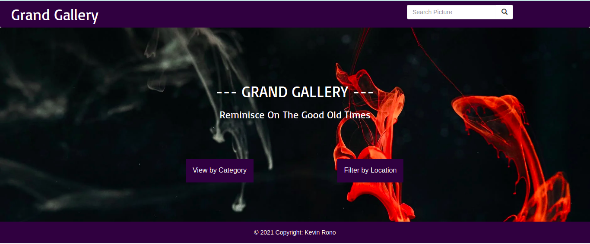
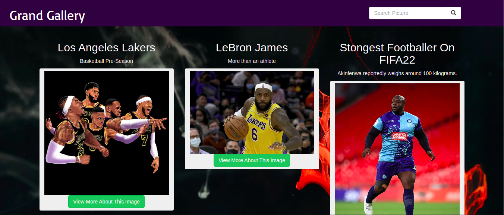
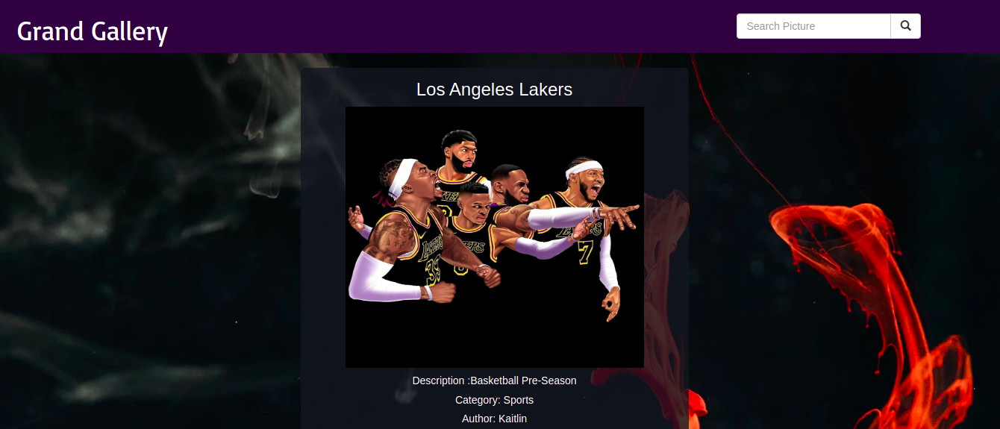

# Grand Gallery

A web app that allows users to filter images to view according to category and location. 

## Description.
This is a Ptython built web app that allows a user to view uploaded photos by filtering them according to the category it was posted and also their location. The images should contain a short description, the author of the image and also the location it was taken at.

## Author & Contact Information.
This web app was created by Kevin Kipyegon. If you have any suggestions or improvements you can reach the author via mail at kevin.kipyegon@student.moringaschool.com.

## Technologies Used
1. Python
2. Flask
3. Heroku - Deployment
4. HTML
5. CSS/Bootstrap

## Project Screenshot

## Liscence.
This is an open source project avaiable under the [MIT Liscence](LISCENCE).